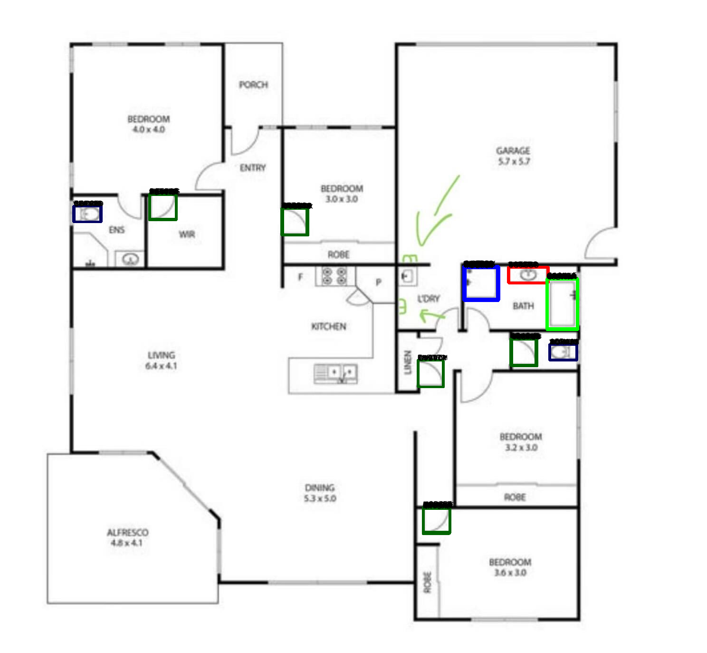
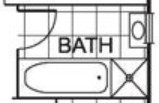

# BathFinder
Locate bathrooms on floorplans using computer vision and whatever works.

## Latest sample output

- Sinks are outlined in red
- Showers are outlined in blue
- Bathtubs are outlined in green
- Doors are outline in dark green
- Toilets are outlined in dark blue

Generated using: `$ python3 ./lab/template_matching007-generic.py --floorplan=./assets/archive/floorplan001.jpg --sink=./assets/sinks/floorplan001-sink01.png --shower=./assets/showers/floorplan001-shower01.png --bathtub=./assets/bathtubs/floorplan001-bathtub01.png --toilet=./assets/toilets/floorplan001-toilet01.png --door=./assets/doors/floorplan001-door01.png`

## Description

- Perform automated floorplan analysis
- Floorplans can be PNG/GIF/JPEG files
- Files are sourced from real estate websites
- Locate bathrooms

## Specifics

- Emphasis will be put on bathrooms that have a sink with a window right above it, a bathtub and a single person shower
- Get in touch with me if you want to know more

